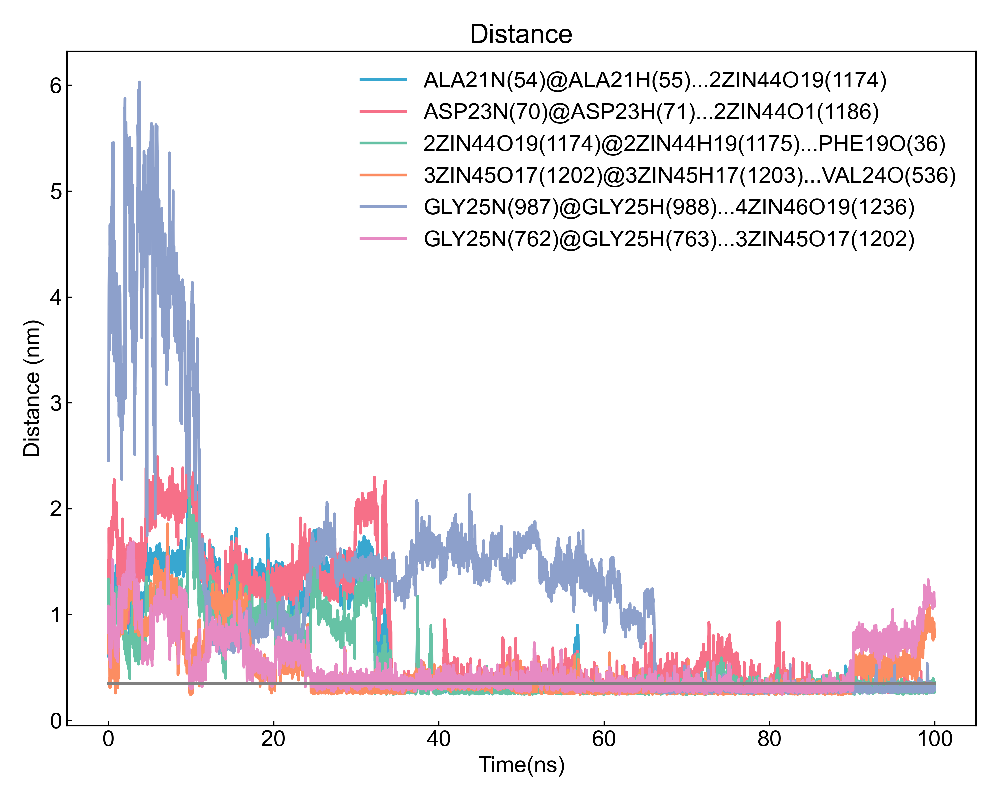

# gmx_Hbond

本模块依赖GROMACS进行氢键的计算，包括氢键的数量、时间占有率、氢键形成的平均距离和角度等。

## Input YAML

```yaml
- gmx_Hbond:
    group1: Protein
    group2: ZIN1 #Ligands # connot start with a number
    top2show: 6
    only_calc_number: no
    gmx_parm:
      b: 50000
      e: 90000
```

`group1`和`group2`是需要计算氢键的两个原子组，如果需要计算同一组原子内的氢键的话，两个组可以写成一样的。需要注意的是，组名不能是数字开头的，例如`1ZIN`这样的组名，会导致GROMACS识别到错误的组。

`top2show`是指展示前面多少个占有率最高的氢键数量，默认是6，可以根据需要调整。

如果只需要计算氢键数量，或者当预估的氢键数量特别大时（例如计算蛋白质和水的氢键），可以将`only_calc_number`设置为`yes`，也即只计算氢键数量，而不计算其他参数。

`gmx_parm`参数下面可以写一些gmx的参数，注意这些参数会被同时连接到`gmx hbond`、`gmx distance`和`gmx angle`命令中，故而必须是三个命令都有的参数才可以。通常可以写一下起止时间之类的参数。

## Output

首先DIP会可视化`gmx hbond`输出的氢键数量图和氢键占有率图：


之后DIP会对检测到的占有率最高的几个氢键，计算其距离和角度随时间的变化，如图：




同时还会对占有率最高的几个氢键进行占有率的可视化：


DIP会统计所有氢键的时间占有率、形成了氢键的平均距离和平均角度，并输出到csv文件中:

```csv
id,donor@hydrogen...acceptor,occupancy(%),Present/Frames,Distance Ave(nm),Distance Std.err(nm),Angle Ave(deg),Angle Std.err(deg)
0,LEU34N(383)@LEU34H(384)...1ZIN43O17(1140),0.02,1/4001,0.3030,0.0000,  9.38,0.00  
1,MET35N(392)@MET35H(393)...1ZIN43O12(1133),0.02,1/4001,0.3280,0.0000, 17.28,0.00  
2,MET35N(392)@MET35H(393)...1ZIN43O19(1143),0.05,2/4001,0.3050,0.0283, 23.95,3.43  
3,LEU34N(608)@LEU34H(609)...1ZIN43O12(1133),0.10,4/4001,0.3300,0.0097, 20.82,7.01  
4,LEU34N(608)@LEU34H(609)...1ZIN43O19(1143),0.07,3/4001,0.3103,0.0295, 22.75,2.69  
5,MET35N(617)@MET35H(618)...1ZIN43O19(1143),0.07,3/4001,0.3227,0.0225, 18.74,9.73  
6,LEU34N(833)@LEU34H(834)...1ZIN43O17(1140),0.02,1/4001,0.3160,0.0000, 29.34,0.00  
7,1ZIN43O12(1133)@1ZIN43H12(1134)...GLY33O(157),0.87,35/4001,0.2846,0.0206, 15.18,7.49  
8,1ZIN43O12(1133)@1ZIN43H12(1134)...ILE31O(368),0.10,4/4001,0.3058,0.0311, 23.62,6.99  
9,1ZIN43O12(1133)@1ZIN43H12(1134)...GLY33O(382),3.77,151/4001,0.2892,0.0214, 15.45,6.85  
10,1ZIN43O12(1133)@1ZIN43H12(1134)...LEU34O(391),0.07,3/4001,0.3140,0.0306, 15.41,0.74  
11,1ZIN43O12(1133)@1ZIN43H12(1134)...ILE31O(593),0.02,1/4001,0.2930,0.0000,  7.55,0.00  
12,1ZIN43O12(1133)@1ZIN43H12(1134)...ILE32O(602),0.07,3/4001,0.3023,0.0146, 10.35,7.95  
13,1ZIN43O17(1140)@1ZIN43H17(1141)...GLY33O(157),0.05,2/4001,0.2775,0.0290,  5.59,3.13  
14,1ZIN43O17(1140)@1ZIN43H17(1141)...LEU34O(166),0.02,1/4001,0.2680,0.0000, 11.76,0.00  
15,1ZIN43O17(1140)@1ZIN43H17(1141)...ALA42O2(225),0.02,1/4001,0.2870,0.0000, 10.91,0.00  
16,1ZIN43O17(1140)@1ZIN43H17(1141)...GLY33O(382),0.07,3/4001,0.3157,0.0350, 18.91,2.10  
17,1ZIN43O17(1140)@1ZIN43H17(1141)...LEU34O(391),0.07,3/4001,0.3340,0.0130, 19.45,3.60  
18,1ZIN43O17(1140)@1ZIN43H17(1141)...GLY33O(607),0.07,3/4001,0.3073,0.0093, 21.60,11.02 
19,1ZIN43O17(1140)@1ZIN43H17(1141)...MET35N(617),0.32,13/4001,0.3325,0.0190, 23.33,3.62  
20,1ZIN43O19(1143)@1ZIN43H19(1144)...GLY33O(157),0.15,6/4001,0.3023,0.0192, 19.65,9.25  
21,1ZIN43O19(1143)@1ZIN43H19(1144)...GLY33O(382),3.47,139/4001,0.2871,0.0224, 17.55,7.71  
22,1ZIN43O19(1143)@1ZIN43H19(1144)...GLY33O(607),0.05,2/4001,0.2830,0.0099, 12.14,8.98  
23,1ZIN43O19(1143)@1ZIN43H19(1144)...LEU34O(616),0.05,2/4001,0.3425,0.0021, 22.81,9.72  
24,1ZIN43O19(1143)@1ZIN43H19(1144)...LEU34O(841),0.40,16/4001,0.2814,0.0164, 21.98,5.46  
25,1ZIN43O1(1155)@1ZIN43H1(1156)...ILE32O(152),0.02,1/4001,0.2990,0.0000, 14.49,0.00  
26,1ZIN43O1(1155)@1ZIN43H1(1156)...GLY33O(157),0.20,8/4001,0.3045,0.0292, 14.32,7.04  
27,1ZIN43O1(1155)@1ZIN43H1(1156)...LEU34N(158),0.02,1/4001,0.3410,0.0000, 28.91,0.00  
28,1ZIN43O1(1155)@1ZIN43H1(1156)...LEU34O(166),0.15,6/4001,0.2892,0.0317, 16.79,5.94  
```

氢键名称由[供体@氢...受体]组成, 每部分的命名含义如下：残基名字、残基编号、原子、括号里面是原子编号。

## References

如果您使用了DIP的本分析模块，请一定引用GROMACS模拟引擎、DuIvyTools(https://zenodo.org/doi/10.5281/zenodo.6339993)，以及合理引用本文档(https://zenodo.org/doi/10.5281/zenodo.10646113)。
