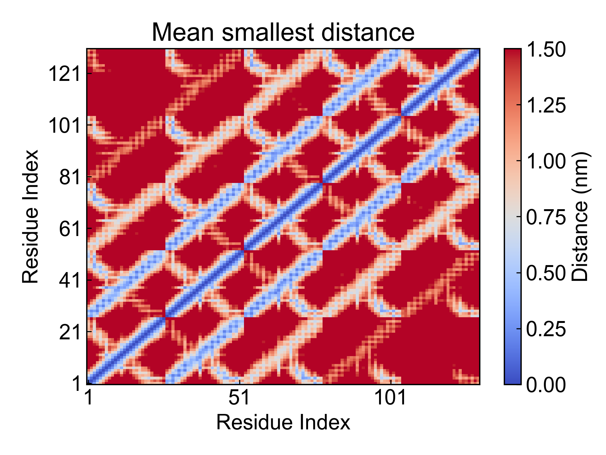
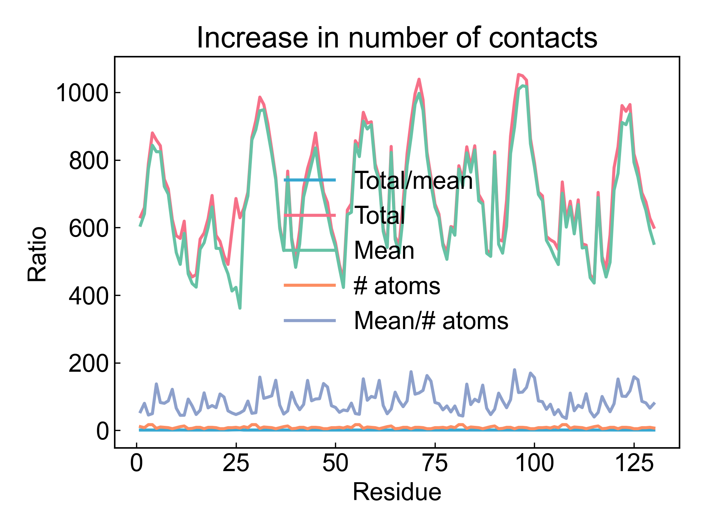

# gmx_Mdmat

此模块利用GROMACS计算残基间的最短距离矩阵，也可以称之为残基接触矩阵。

## Input YAML

```yaml
- gmx_Mdmat:
    group: Protein
    gmx_parm:
      t: 1.5
```

只需要确定需要计算的组就可以了。也可以通过`gmx_parm`参数来设置一些额外的参数，如这里设置了距离截断`-t 1.5`。DIP默认会调用`-mean -no`两个输出参数，因而这俩个不需要在这里添加。

## Output

DIP会将产生的平均的残基接触矩阵可视化，以及绘制接触数量随时间变化的折线图：





## References

如果您使用了DIP的本分析模块，请一定引用GROMACS模拟引擎、DuIvyTools(https://zenodo.org/doi/10.5281/zenodo.6339993)，以及合理引用本文档。

