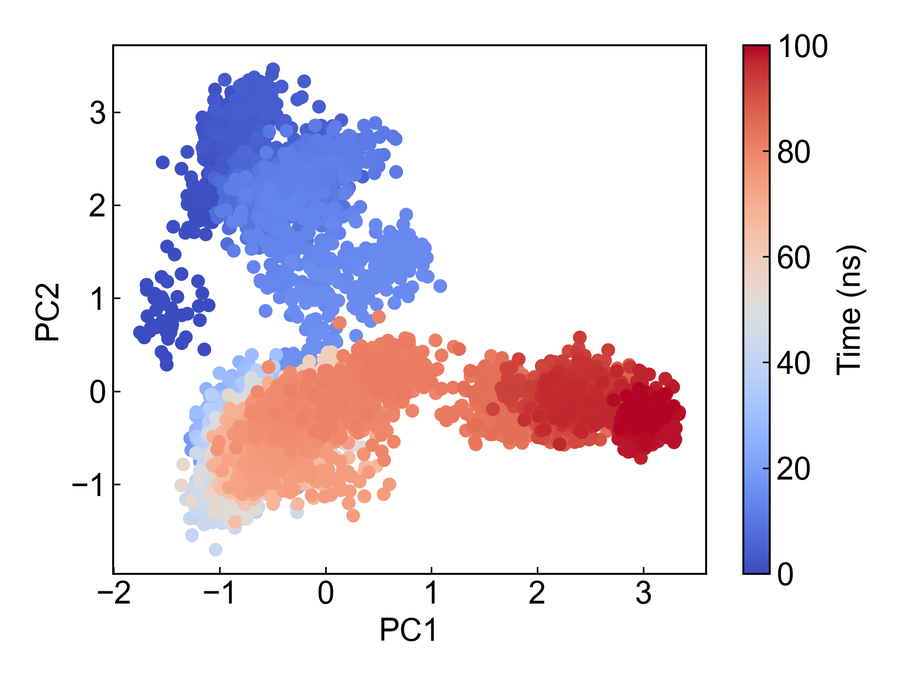
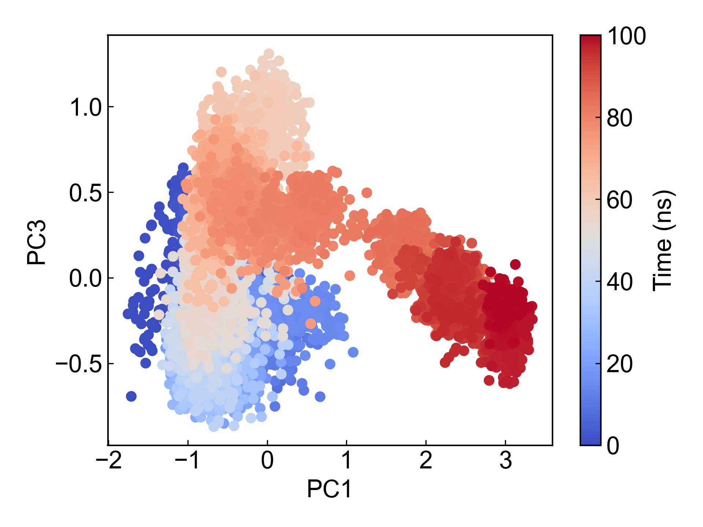
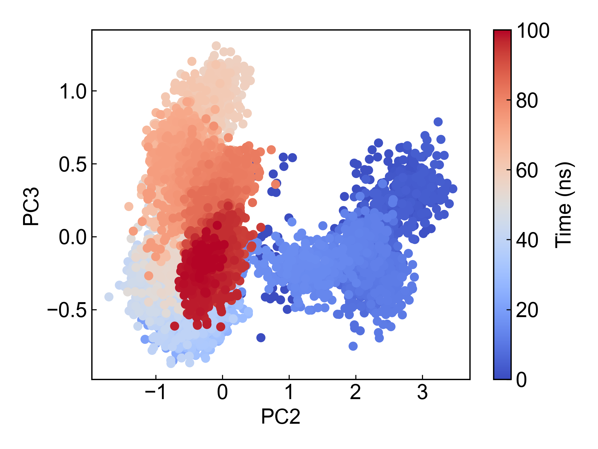
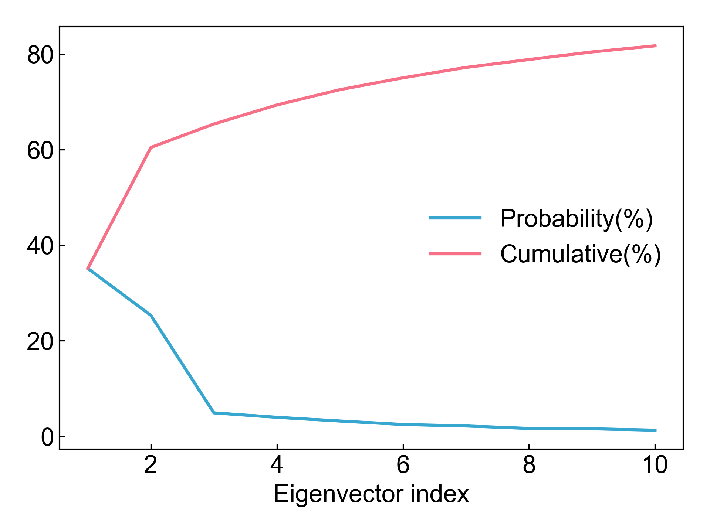
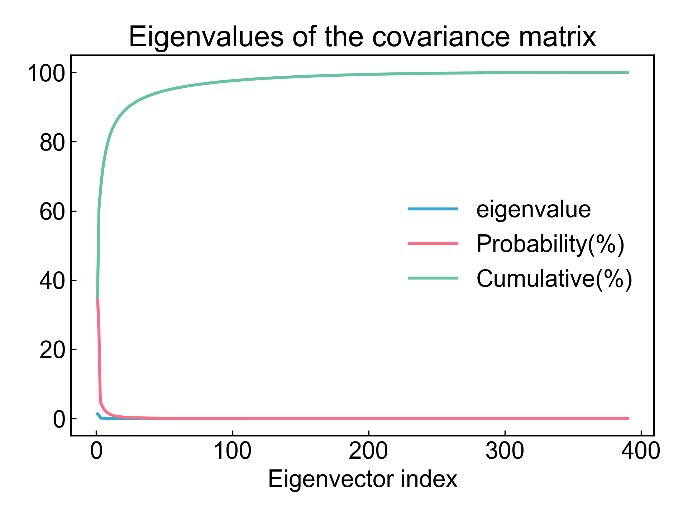

# gmx_PCA

本模块依赖GROMACS进行所选原子组的坐标的主成分分析。

使用本模块前请注意[前置处理](https://duivyprocedures-docs.readthedocs.io/en/latest/Framework.html#id7)已经完成！

## Input YAML

```yaml
- gmx_PCA:
    group: C-alpha
    gmx_parm:
      tu: ns
```

`group`: 选择要进行主成分分析的原子组，对于蛋白质一般可以选择C-alpha。

`gmx_parm`: 用户可以在这里附加一些`gmx covar`和`gmx anaeig`命令的共有的参数，例如控制时间的`-b -e`等。

## Output

完成PCA计算之后，本模块会导出前三个主成分并分别绘制两两主成分的散点图，以及所有和前10主成分的占比折线图。











同时DIP也会整理好前三个主成分的两两主成分的xvg文件，可以直接用于`gmx_FEL`模块绘制基于PCA的自由能形貌图。

## References

如果您使用了DIP的本分析模块，请一定引用GROMACS模拟引擎、DuIvyTools(https://zenodo.org/doi/10.5281/zenodo.6339993)，以及合理引用本文档(https://zenodo.org/doi/10.5281/zenodo.10646113)。