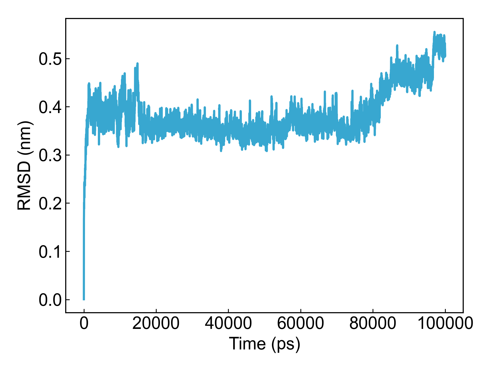
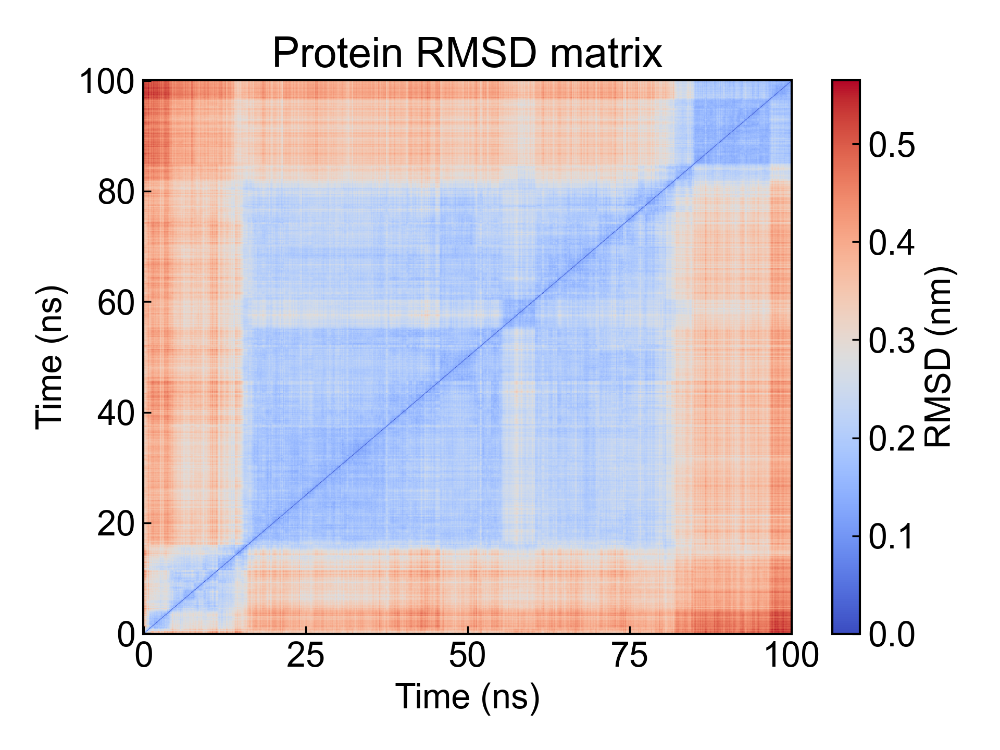

# gmx_RMSD

此模块依赖GROMACS进行均方根偏差的计算。

## Input YAML

```yaml
- gmx_RMSD:
    calc_group: Protein
    fit_group: Backbone
    rmsd_matrix: no
```

RMSD计算过程中需要先对体系进行对齐，之后再计算结构与参考结构的RMSD。因而这里`fit_group`是用于指定对齐组的，而`calc_group`用于指定计算RMSD的组。

`rmsd_matrix`用于指定是否输出帧间的RMSD矩阵。如果设置为`yes`，则会输出RMSD矩阵，但请注意，计算RMSD矩阵是一个比较耗时的过程，用户可以通过`gmx_parm`参数设置一下连接到`gmx rms`命令的参数，以减少需要计算的帧，例如：

```yaml
- gmx_RMSD:
    mkdir: RMSD2
    calc_group: Protein
    fit_group: Backbone
    rmsd_matrix: yes
    gmx_parm:
      tu: ns
      dt: 0.1
```

## Output

DIP会将计算的到的RMSD数据绘制成折线图，如果有计算RMSD矩阵的话，DIP也会一同可视化。






## References

如果您使用了DIP的本分析模块，请一定引用GROMACS模拟引擎、DuIvyTools(https://zenodo.org/doi/10.5281/zenodo.6339993)，以及合理引用本文档。