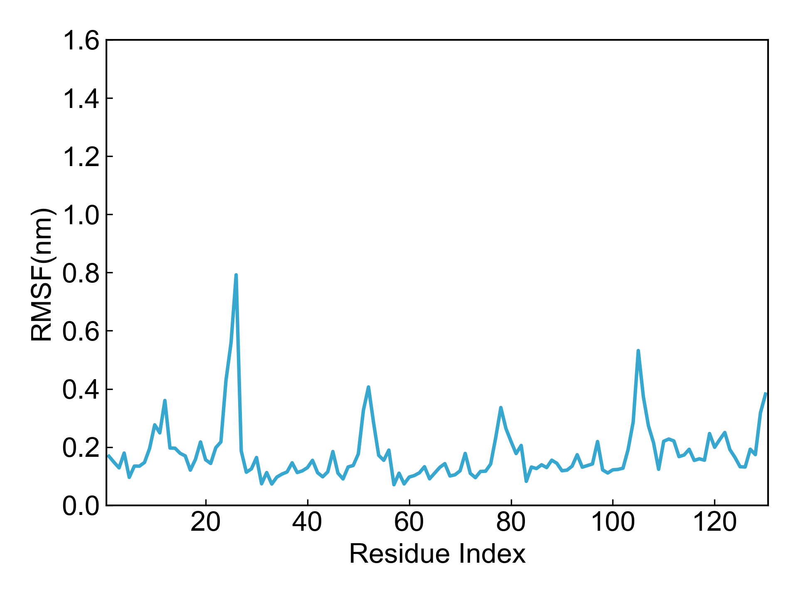

# gmx_RMSF

此模块依赖GROMACS进行均方根波动（RMSF）的计算。

## Input YAML

```yaml
- gmx_RMSF:
    calc_group: Protein
    by_residues: true
    multichain: yes
```

`calc_group`：计算组，即需要计算RMSF的原子组。

`by_residues`：是否以残基为单位计算RMSF, `no`表示以原子为单位计算。

`multichain`：体系是否是多链，也即残基编号是否有重复；如果有重复的话，绘图会出现很乱的折线，这里设置一下之后，DIP在绘图的时候会对残基重新编号；这里的示例体系包含多条链，故而设置为yes。

如果还需要对`gmx rmsf`命令添加其它的参数设置，可以使用`gmx_parm`参数。

## Output

DIP会对得到的RMSF数据进行绘图：




## References

如果您使用了DIP的本分析模块，请一定引用GROMACS模拟引擎、DuIvyTools(https://zenodo.org/doi/10.5281/zenodo.6339993)，以及合理引用本文档。