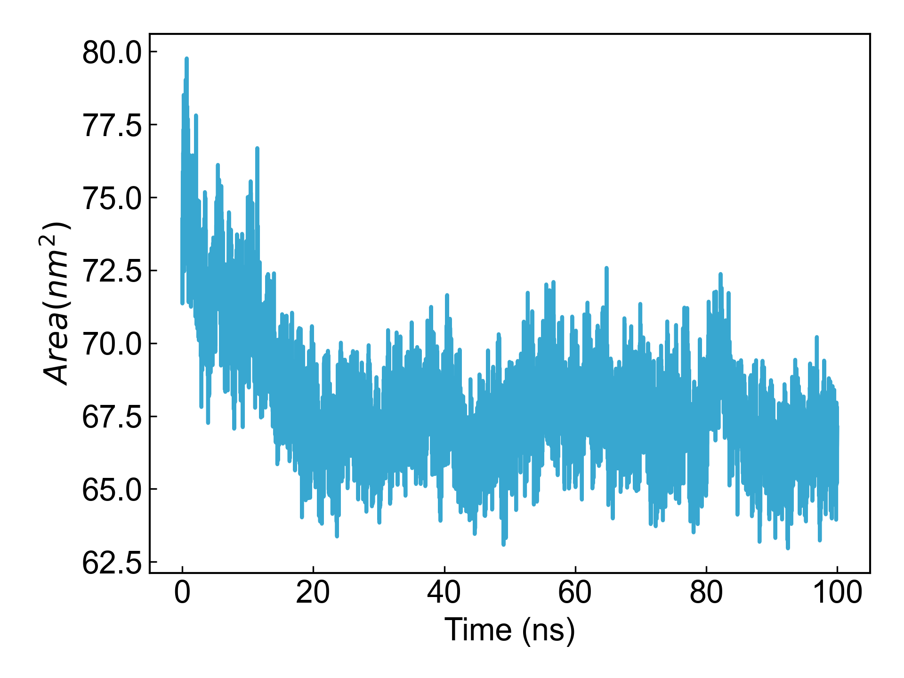

# gmx_SASA

此模块依赖GROMACS进行溶剂可及表面积（SASA）的计算。

## Input YAML

```yaml
- gmx_SASA:
    group: Protein
    gmx_parm:
      tu: ns
```

`group`参数设定要计算SASA的原子组。同时也可以通过`gmx_parm`增加一些想要添加到`gmx sasa`命令中的参数。

## Output

DIP会可视化计算得到的面积随时间的变化：



## References

如果您使用了DIP的本分析模块，请一定引用GROMACS模拟引擎、DuIvyTools(https://zenodo.org/doi/10.5281/zenodo.6339993)，以及合理引用本文档。
