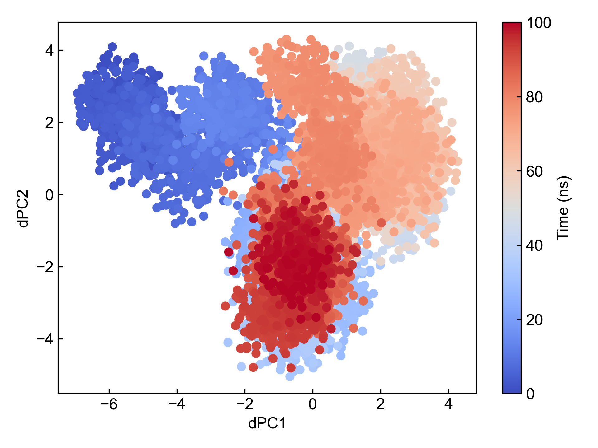
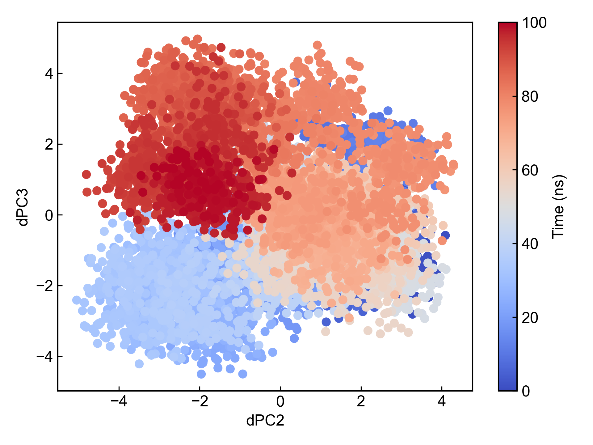
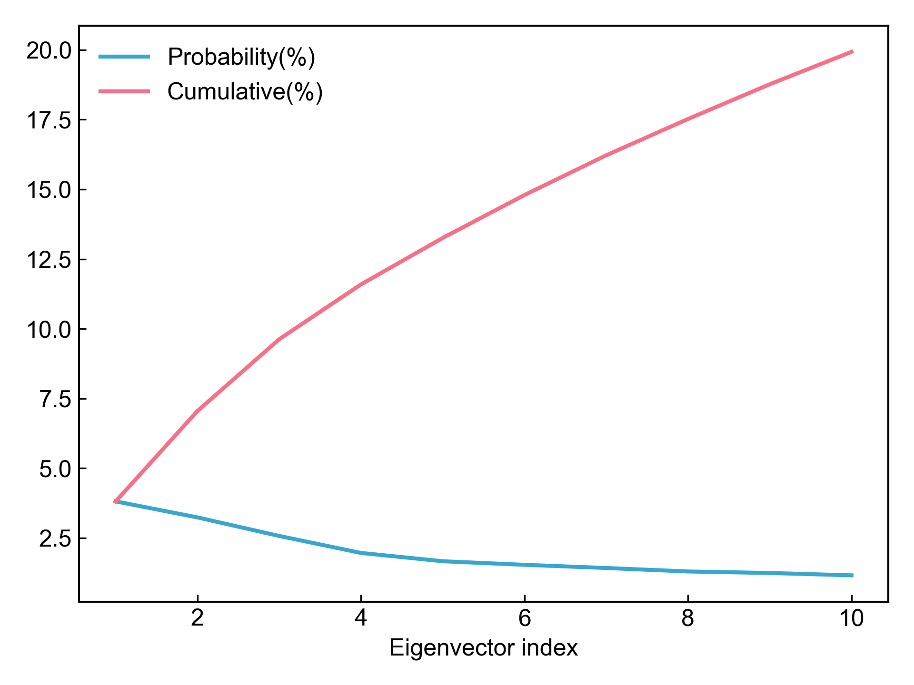
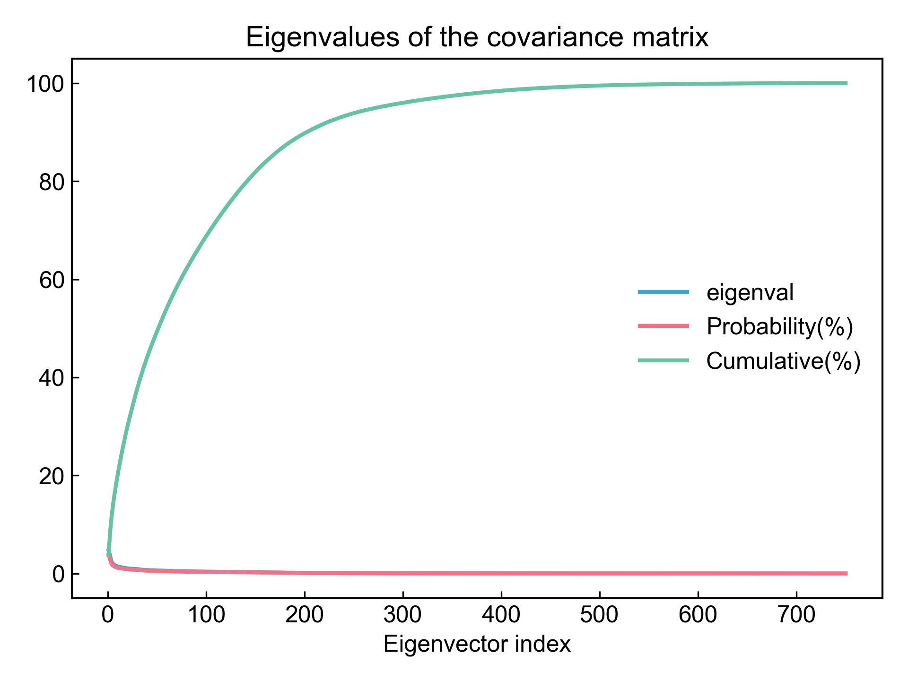

# gmx_dPCA

本模块利用GROMACS进行蛋白质骨架二面角的主成分分析。

具体计算过程请参考：https://zhuanlan.zhihu.com/p/479009558

由于`gmx angle`命令的存在，此模块的计算会非常慢；同时考虑到DIP不限制GROMACS的版本，而有些GROMACS版本中`gmx anaeig`命令的输出可能存在问题；再加上dPCA计算还有些科学性上的争议：
- https://doi.org/10.1002/prot.20310
- https://doi.org/10.1063/1.2746330

因此，**建议用户使用此模块进行dPCA计算之后仔细检查分析结果！！！**

## Input YAML

```yaml
- gmx_dPCA:
    group: Protein
    gmx_parm:
      tu: ns
```

`group`：蛋白质组名，即`Protein`，也可以选择包含了骨架原子的其他组。
`gmx_parm`：此模块涉及到多个GROMACS命令，这里的gmx_parm参数只会被添加到`gmx anaeig`命令中，用于导出主成分，因而可以一般可以用户自定义`gmx anaeig`命令的参数。

## Output

完成dPCA计算之后，本模块会导出前三个主成分并分别绘制两两主成分的散点图，以及所有和前10主成分的占比折线图。










同时DIP也会整理好前三个主成分的两两主成分的xvg文件，可以直接用于`gmx_FEL`模块绘制基于dPCA的自由能形貌图。


## References

如果您使用了DIP的本分析模块，请一定引用GROMACS模拟引擎、DuIvyTools(https://zenodo.org/doi/10.5281/zenodo.6339993)，以及合理引用本文档(https://zenodo.org/doi/10.5281/zenodo.10646113)。

同时请一定引用dPCA的相关文献：
- https://doi.org/10.1002/prot.20310
- https://doi.org/10.1063/1.2746330
