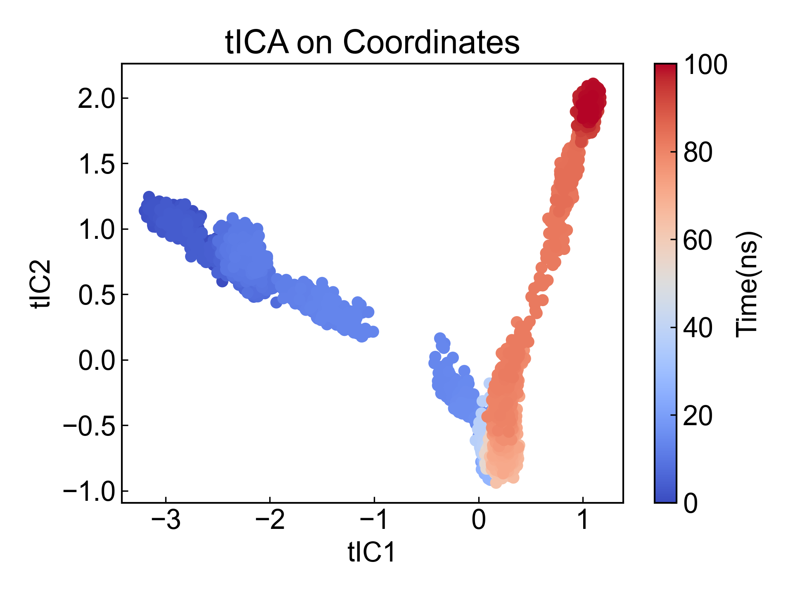
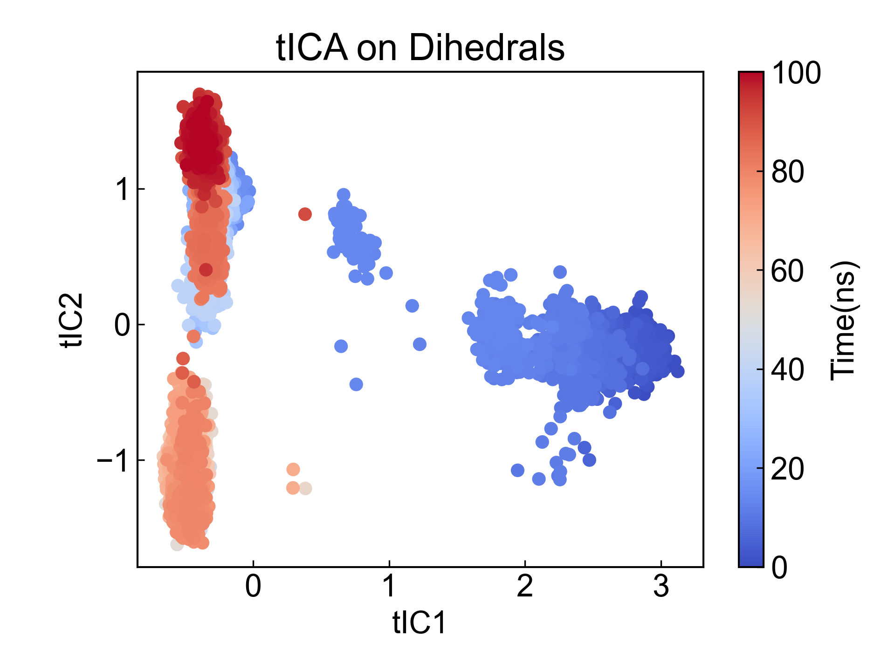

# tICA
Time-lagged independent component analysis (TICA)是一种降维手段，此模块可以用于计算所选原子组的tICA。可以对坐标进行tICA，也可以对蛋白质骨架二面角做tICA。

## Input YAML

```yaml
- tICA:
    atom_selection: protein and name CA
    target: coordinates
    lag: 10
- tICA:
    mkdir: tICA_d
    atom_selection: protein
    target: dihedrals
    lag: 10
```

这里同时列举了基于坐标和基于二面角的tICA分析所需要的参数。

`atom_selection`：原子选择，用于指定需要进行tICA的原子组。如果进行二面角分析的话，则所选的原子组必须包含形成骨架二面角的原子。这里的原子选择的语法完全遵从MDAnalysis的原子选择语法。请参考：https://userguide.mdanalysis.org/1.1.1/selections.html

`target`：tICA的目标，可以是`coordinates`或`dihedrals`。如果选择`coordinates`，则tICA将基于原子的坐标进行分析；如果选择`dihedrals`，则tICA将基于二面角进行分析。

`lag`：tICA的lag time参数。此模块利用deeptime.decomposition.TICA函数进行计算。

## Output

此模块通过会将前三个成分的结果保存到xvg文件中，并两两可视化成散点图。

这里只举例前两个成分的结果: 






## References

如果您使用了DIP的本分析模块，请一定引用MDAnalysis、deeptime(http://dx.doi.org/10.1088/2632-2153/ac3de0)、DuIvyTools(https://zenodo.org/doi/10.5281/zenodo.6339993)，以及合理引用本文档。
