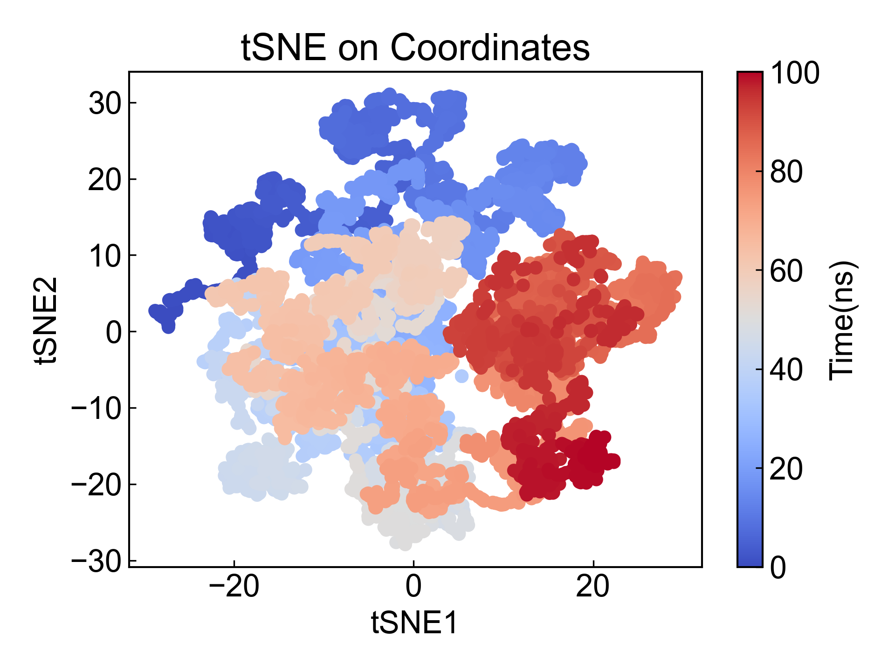
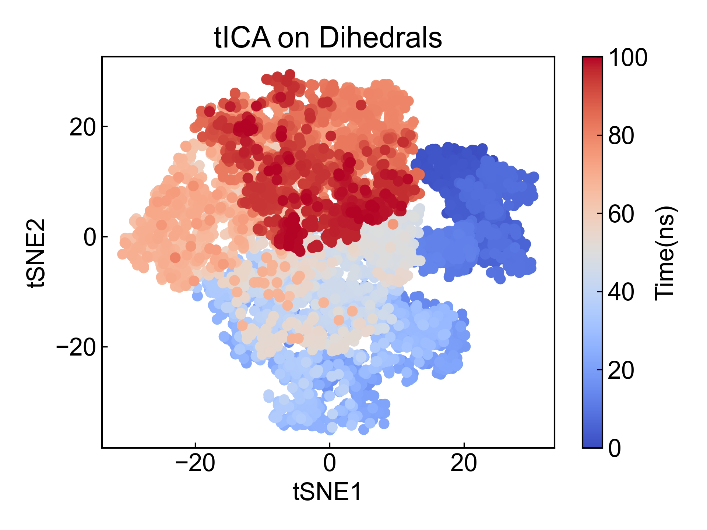

# tSNE

t-distributed Stochastic Neighbor Embedding (tSNE)是一种降维手段，此模块实现了基于坐标和二面角的tSNE分析。

使用本模块前请注意[前置处理](https://duivyprocedures-docs.readthedocs.io/en/latest/Framework.html#id7)已经完成！

## Input YAML

```yaml
- tSNE:
    atom_selection: protein and name CA
    byType: atom # res_com, res_cog, res_coc
    target: coordinates
- tSNE:
    mkdir: tSNE_d
    atom_selection: protein
    byType: atom # res_com, res_cog, res_coc
    target: dihedrals
```

这里同时列举了基于坐标和基于二面角的tICA分析所需要的参数。

`atom_selection`：原子选择，用于指定需要进行tSNE的原子组。如果进行二面角分析的话，则所选的原子组必须包含形成骨架二面角的原子。这里的原子选择的语法完全遵从MDAnalysis的原子选择语法。请参考：https://userguide.mdanalysis.org/1.1.1/selections.html

`byType`：指定计算基于坐标的降维的方式，只有`target`为`coordinates`时有效。有四种选择：`atom`、`res_com`、`res_cog`、`res_coc`。`atom`计算选中的所有原子坐标的降维；常见的，可以选择CA原子`protein and name CA`来计算蛋白质的降维；`res_com`计算每个残基的质心的降维；`res_cog`计算每个残基的几何中心的降维；`res_coc`计算每个残基的电荷中心的降维。当为`res_com`、`res_cog`或`res_coc`时，原子选择器应当包含选中的残基的所有原子，否则只会计算某一残基中选中原子的质心、几何中心或者电荷中心的降维。

`target`：tSNE的目标，可以是`coordinates`或`dihedrals`。如果选择`coordinates`，则tSNE将基于原子的坐标进行分析；如果选择`dihedrals`，则tSNE将基于二面角进行分析。

**需要注意的是**：dPCA的文献中讨论到二面角与坐标不同，二面角具有周期性；因而dPCA的文章中是对角度进行了三角变换再将之应用于PCA分析，而此模块同样将二面角转换成sin和cos值再进行降维分析。**用户在利用此模块进行二面角的降维分析的时候，需要妥善对照文献分析计算过程是否合适！如果不确定，请不要使用此模块的二面角降维分析** 有任何问题或者改进的建议，请联系杜若，杜若和杜艾维非常欢迎任何的建议和argue，非常感谢！。

本模块还有三个隐藏参数可以对轨迹做帧的选择：

```yaml
      frame_start:  # start frame index
      frame_end:   # end frame index, None for all frames
      frame_step:  # frame index step, default=1
```

这些参数可以指定计算轨迹的起始帧、终止帧（不包含）以及帧的步长。默认情况下，用户不需要设置这些参数，模块会自动分析整个轨迹。

例如我们计算从1000帧开始，到5000帧结束，每隔10帧的DCCM：

```yaml
      frame_start: 1000 # start frame index
      frame_end:  5001 # end frame index, None for all frames
      frame_step: 10 # frame index step, default=1
```

如果三个参数中只需要设置一个或两个，其余的参数都可以省略。


## Output

此模块通过会将前三个成分的结果保存到xvg文件中，并两两可视化成散点图。

这里只举例前两个成分的结果: 






## References

如果您使用了DIP的本分析模块，请一定引用MDAnalysis、scikit-learn(https://scikit-learn.org/stable/about.html#citing-scikit-learn)、DuIvyTools(https://zenodo.org/doi/10.5281/zenodo.6339993)，以及合理引用本文档(https://zenodo.org/doi/10.5281/zenodo.10646113)。